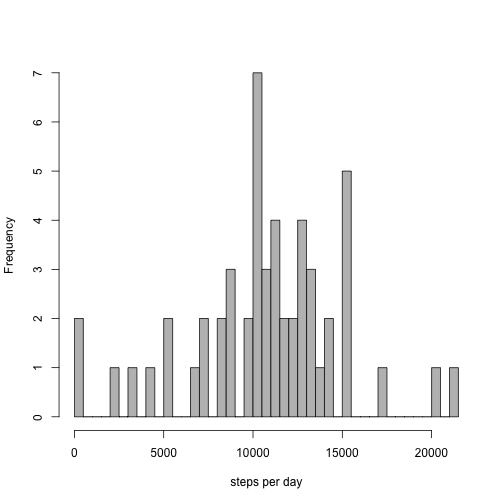
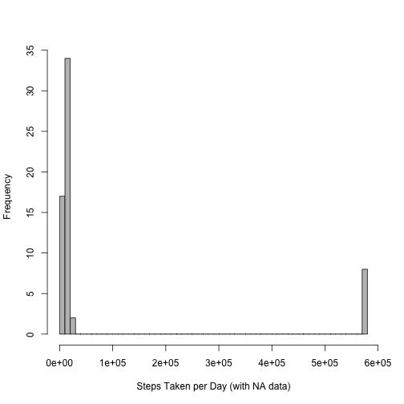
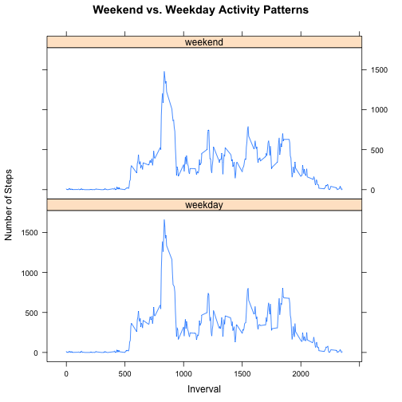

Reproducible Research Project 1
========================================================

## Loading and preprocessing the data

```r
activity <- read.csv("~/Desktop/Coursera/activity.csv")
```


## What is the mean total of steps taken per day?

```r
daySteps <- aggregate(steps ~ date, data = activity, FUN = sum)
summary(daySteps)
```

```
##          date        steps      
##  2012-10-02: 1   Min.   :   41  
##  2012-10-03: 1   1st Qu.: 8841  
##  2012-10-04: 1   Median :10765  
##  2012-10-05: 1   Mean   :10766  
##  2012-10-06: 1   3rd Qu.:13294  
##  2012-10-07: 1   Max.   :21194  
##  (Other)   :47
```


```r
# Histogram of the total number of steps taken each day
hist(daySteps$steps, breaks = nrow(daySteps), xlab = "steps per day", main = NULL, 
    col = "grey")
```

 

## What are the mean and median number of steps per day?

```r
mean <- mean(daySteps$steps)
median <- median(daySteps$steps)
```

The mean total number of steps in a given day is 10766.
The median total number of steps taken per day is 10765.

## What is the average daily activity pattern?

```r
intervalSteps <- aggregate(steps ~ interval, data = activity, FUN = sum)
```


```r
# make a time series plot of the 5-min interval
plot(intervalSteps, xlab = "Interval (Time)", ylab = "Average Number of Steps Taken", 
    type = "l")
```

 


```r
# find the interval with the maximum number of steps
max <- intervalSteps[which.max(intervalSteps$steps), "interval"]
```

The inverval containing the maximum number of steps is 835.

## Imputing missing values

```r
# calculate the total number of missing values in the dataset
missing <- sum(is.na(activity))
```

The total number of missing values is 2304.
These missing values will be replaced with the daily mean value of the corresponding 5- minuite interval. 


```r
# create new dataset
daySteps.2 <- numeric()
for (i in 1:nrow(activity)) {
    x.dat <- activity[i, ]
    if (is.na(x.dat$steps)) {
        steps <- subset(intervalSteps, interval == x.dat$interval)$steps
    } else {
        steps <- x.dat$steps
    }
    daySteps.2 <- c(daySteps.2, steps)
}
newActivity <- activity
newActivity$steps <- daySteps.2

# find the total number of steps taken per day with the new data
newDaySteps <- aggregate(steps ~ date, data = newActivity, FUN = sum)
```


```r
# histogram with the new dataset
hist(newDaySteps$steps, breaks = nrow(newDaySteps), col = "grey", xlab = "Steps Taken per Day (with NA data)", 
    main = NULL)
```

 


```r
# recalculating mean and median
newMean <- mean(newDaySteps$steps)
newMedian <- median(newDaySteps$steps)
```

The mean number of steps taken using the new dataset, where NA values were replaced with averages, is 84188.
The median number of steps taken using the new dataset, where NA values were replaced with averages, is 11458.

After replacing missing step data with averaged values generated from the data, the mean mean number of steps taken per day did not change.  However, the median number of steps taken per day did increase from 10765 to 11458.

## Are there differences in activity patterns between weekdays and weekends? 

```r
# create new factor varialbe for weekdays and weekends from date column
wd <- activity$date
wd <- strptime(wd, "%Y-%m-%d")
wd <- weekdays(wd)
wd <- as.character(wd)
for (i in 1:length(wd)) {
    if (wd[i] == "Saturday" | wd[i] == "Sunday") {
        wd[i] <- "weekend"
    } else {
        wd[i] <- "weekday"
    }
}
wd <- factor(wd)

newActivity$wd <- wd
```


```r
# making panel plot for weekdays vs. weekends
require(plyr)
```

```
## Loading required package: plyr
```

```r
require(lattice)
```

```
## Loading required package: lattice
```

```r
wdMeanSteps <- ddply(newActivity, .(interval, wd), summarize, steps = mean(steps))
xyplot(steps ~ interval | wd, data = wdMeanSteps, type = "l", layout = c(1, 
    2), ylab = "Number of Steps", xlab = "Inverval", main = "Weekend vs. Weekday Activity Patterns")
```

 

According to the data, there do not appear to be differences in weekend and weekday activity patterns. 
